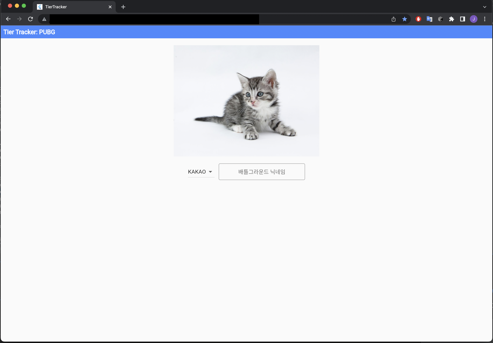
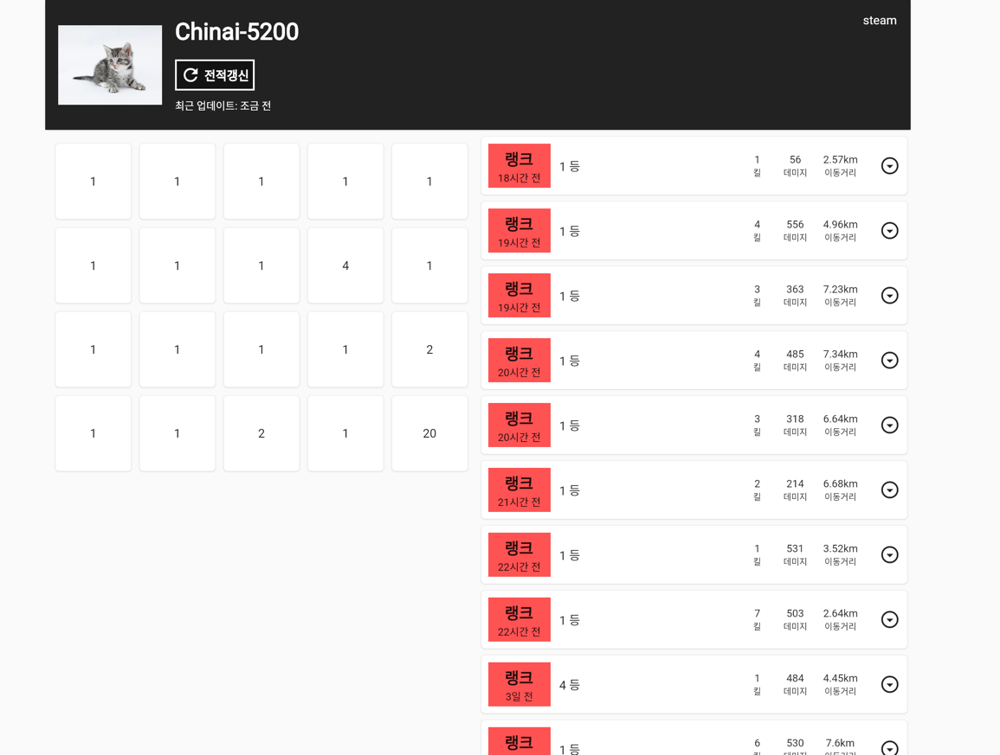
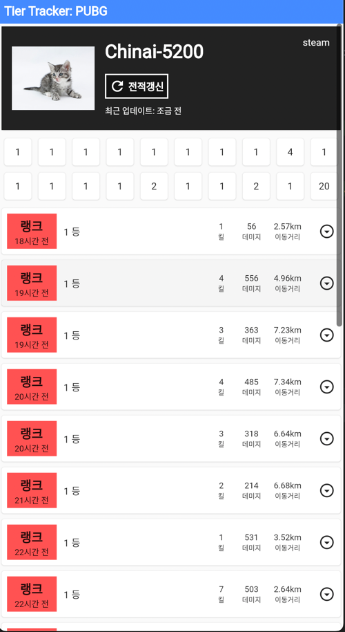
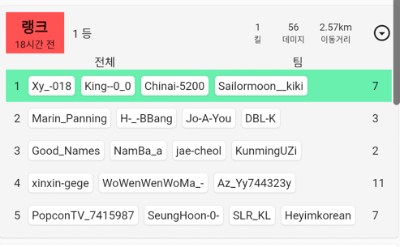

# Tier Tracker For Web

게임 전적검색 및 티어 트래킹을 위한 서비스를 위한 웹버전  
좌우 너비에 따라 동적으로 위젯을 배치함.  
UI는 op.gg를 참고하여 구성하였음.

### 데모 영상
- [데모 영상 링크](https://youtu.be/A6HcUlw1qoM)

### flutter 버전정보
```
flutter --version                                                                                                                 19:52:31
Flutter 2.10.3 • channel stable • https://github.com/flutter/flutter.git
Framework • revision 7e9793dee1 (4주 전) • 2022-03-02 11:23:12 -0600
Engine • revision bd539267b4
Tools • Dart 2.16.1 • DevTools 2.9.2
```

# How to Run
1. server 디렉토리 하위에 있는 서버 프로젝트를 디플로이
2. 해당 AWS API GATEWAY 주소를 lib/app/game/pubg/apis/pubg_api.dart의 url에 입력해줌.
3. 실행하여, 닉네임 검색


# 홈 화면



# 검색결과



## 홈페이지 좌우길이를 줄이면 줄어듬 ( for mobile )


## 각 전적을 누르면, 결과를 볼 수 있음
